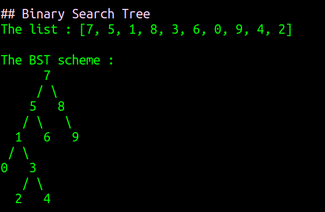

## Insertion Sort
The list before insertion sort : [7, 3, 5, 8, 2, 9, 4, 15, 6]

- Step1: [2, 3, 5, 8, 7, 9, 4, 15, 6]
- Step2: [2, 3, 4, 8, 7, 9, 5, 15, 6]
- Step3: [2, 3, 4, 5, 7, 9, 8, 15, 6]
- Step4: [2, 3, 4, 5, 6, 9, 8, 15, 7]

-----

## Merge Sort
The list before merge sort : [16,21,11,8,12,22]

- Step1: [[16, 21, 11], [8, 12, 22]]
- Step2: [[[16], [21, 11]], [[8], [12, 22]]]
- Step3: [[[16], [[21], [11]]], [[8], [[12], [22]]]]
- Step4: [[[16], [11, 21]], [[8], [12, 22]]]
- Step5: [[11, 16, 21], [8, 12, 22]]
- Step6: [8, 11, 12, 16, 21, 22]

-----

## Binary Search Tree

