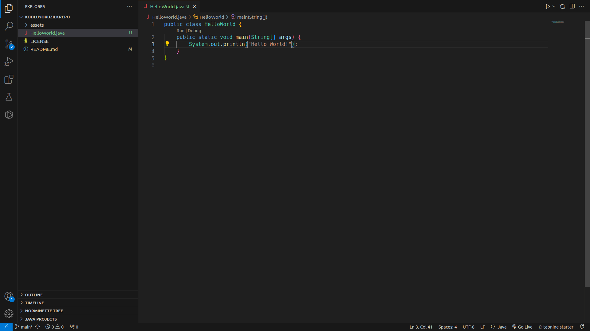

# kodluyoruzilkrepo
Bu repo [Kodluyoruz](https://kodluyoruz.org) Başlangıç Seviye Java ile Backend Web Development eğitiminde oluşturduğumuz ilk repo. İçerisinde bir adet README dosyası, bir adet de helloworld.java dosyası barındırıyor.



## Kurulum
Öncelikle projeyi klonlayın.

```bash
git clone https://github.com/AllDev0/kodluyoruzilkrepo.git
```

## Kullanım
Projeyi klonladıktan sonra Visual Studio Code programında açınız.

Linux için:
```linux
cd kodluyoruzilkrepo
code .
```

## Katkı
Pull Requestler kabul edilir. Büyük değişiklikler için, lütfen önce neyi değiştirmek istediğinizi tartışmak için bir konu açınız.

## Lisans
[MIT](https://choosealicense.com/licenses/mit/)
